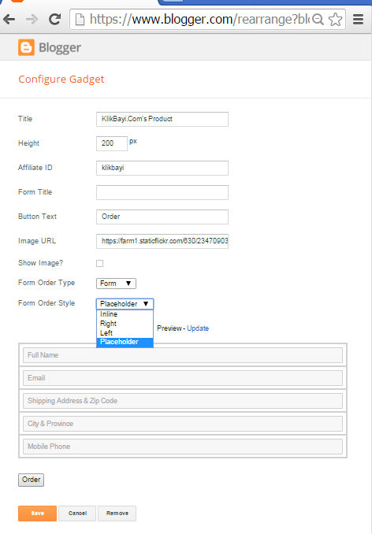
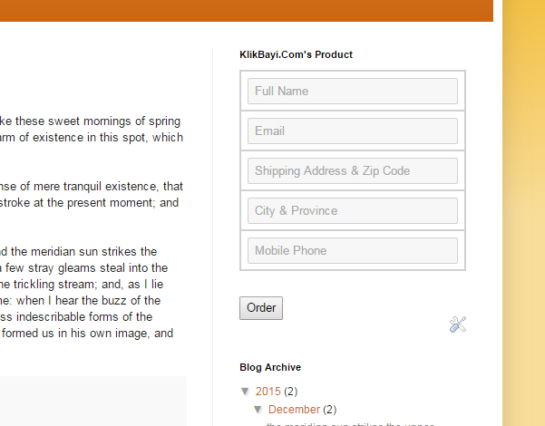

## KlikBayi Gadgets for Blogger/Blogspot
**Marketing Tool for KlikBayi Affiliate** blogger gadget is created to support http://klikbayi.com/ affiliaters to selling klikbayi.com's product with embeded form or button order into **Blogger** blog.

## Installation
1. On `Blogger Dashboard`, select your blog.
2. Go to `Layout` > `Add a Gadget` > `Add your own` tab, enter the URL of KLIKBAYI, then `Add by URL`.
3. `Configure Gadget`, you mast add your KlikBayi `Affiliate ID`. If you don't have one, please register [here](http://klikbayi.com/affiliasi.php "Affiliate Page").
4. Save your work and you are ready to go.

## Screenshots
1. Configure Gadget

2. Gadget on Template

## Changelog
* 1.0 = December 24, 2015
 * First official release!

## Upgrade Notice
###### v1.0
NONE